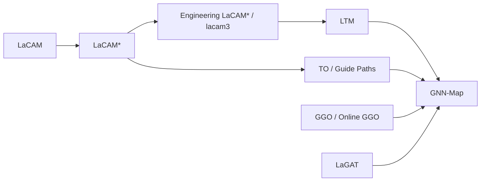
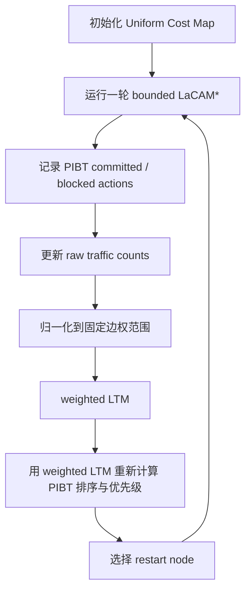
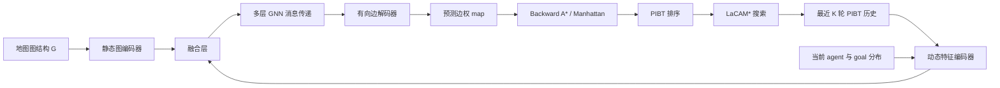
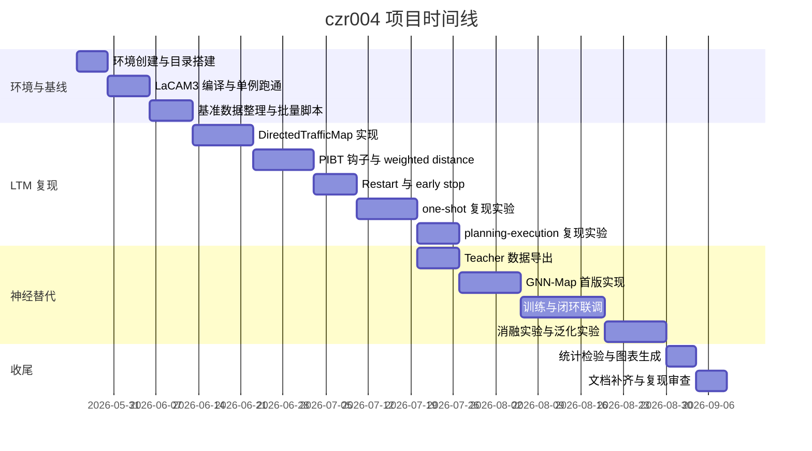

# 在 LaCAM 与 LTM 基础上复现并以 GNN 替代 Traffic Map 的项目总纲

## 执行摘要

本项目的目标，是在 `C:\PROGRAMING\czr004` 路径下，以 **LaCAM\*** 为搜索主干、以 **Lightweight Traffic Map，LTM** 为第一阶段复现对象，先完成 **LTM 的论文级复现**，再进一步研究 **用 GNN 或其他神经网络替代 LTM 中手工累计的 Traffic Map 更新机制**。从现有一手资料看，LaCAM/LaCAM\* 是一类面向大规模 MAPF 的高效搜索框架；LaCAM\* 引入 anytime 机制并在标准 MAPF 基准上表现出很强的规模能力，而后续的 Engineering LaCAM\* 进一步把它工程化为 `lacam3` 代码库。LTM 则直接利用 LaCAM\* 搜索过程中 PIBT 低层生成器产生的“已执行动作”和“被阻塞动作”来在线构建有向加权 traffic map，并通过频繁重启与动态更新，在 one-shot MAPF 与 planning-and-execution MAPF 上都优于静态 guide path 类方法。与此同时，LTM 论文正文明确给出了核心算法逻辑、实验设置和若干关键超参，但截至其 arXiv HTML 版本，源码链接仍是占位符而非可访问的正式仓库，因此本总纲将把“**基于 LaCAM3 官方仓库自行补齐 LTM 复现实装**”作为现实起点。citeturn22academia1turn25academia1turn27view0turn40view0turn44view0turn41view7

需要先明确一件事：你要求“按已上传 md 模板格式”组织章节，但当前会话中我无法检索到可访问的上传模板文件。因此，下面的文稿采取**项目总纲常见且与你消息中显式点名的模块严格对齐**的方式组织：包含目录式导航、实验设置、代码结构、依赖、时间表、里程碑、评估指标、统计显著性检验、风险与应对、可复现性说明，以及最后一页可直接复制的命令清单。凡论文或官方仓库未明确给出的细节，我都标记为“**未指定**”。本方案的总体判断是：**先复现 LTM，再做“神经网络替代 Traffic Map”是合理且可落地的路线**；其中最稳妥的研究主线，不是直接用端到端神经策略替代整个 LaCAM\*，而是让 **GNN 预测“边权版 traffic map”**，继续沿用 LaCAM\* 的搜索框架、PIBT 冲突解析与 anytime/restart 机制，这样既尊重原论文结构，也更容易做公平对照和误差归因。citeturn40view0turn44view0turn41view4turn43view0turn72view0

## 模板适配与项目边界

### 本文目录

- 模板适配与项目边界
- 文献依据与技术基线
- LTM 复现方案
- GNN 替代 Traffic Map 方案
- 工程结构与依赖环境
- 评估设计、可复现性与项目管理
- 实施步骤清单

### 项目目标

本项目分成两个阶段。**阶段一**是复现 LTM：以 LaCAM3 官方代码库为基础，补充 LTM 论文中定义的 lightweight traffic map、有向边权更新、基于 weighted LTM 的 backward continuous A* / Manhattan heuristic、基于当前 makespan 的 node budget、以及 frequent restart 逻辑。**阶段二**是在尽量不改变 LaCAM\* 搜索主干的前提下，用 GNN 或其他 NN **替代“手工累计 + 归一化”得到的 traffic map**，让神经网络输出一个动态 edge-cost map，再把这个 map 嵌入 PIBT/LaCAM\* 的 evaluation function、agent priority 与 push-and-swap 相关距离估计中。LTM 本身正是这样修改 LaCAM\* 的：它保留搜索主干，修改低层引导与 anytime 重启，因此这种替代方式与原方法最同构。citeturn41view4turn43view0turn41view6

### 边界与未指定项

LTM 论文公开了方法与实验描述，但源码仓库在文中仍是“接受后发布”的占位符；因此，**官方 LTM CLI、配置文件名、完整默认参数表、以及作者最终实现中的工程细节**目前都不能被直接核验。相反，LaCAM3 的官方 GitHub 仓库是可访问的，构建方式、命令行参数、实验脚本目录和测试目录都可直接核验。因此，本项目总纲采用“**LaCAM3 官方仓库 + LTM 论文方法细化 + 本项目新增 CLI/配置约定**”的方式组织，而不伪造不可核验的“官方 LTM 命令”。凡此类内容，均明确标注为“项目实现约定”而非“论文原生命令”。citeturn41view7turn27view0turn49view0turn50view0

### 交付物定义

本总纲对应的交付物应至少包括以下八类内容：一份中文项目总纲 `PROJECT_OUTLINE.md`；一个固定在 `C:\PROGRAMING\czr004` 的项目根目录；一个名为 `czr004` 的 conda 环境；一套可运行的 LaCAM3 基线与 LTM 复现实装；一套 GNN-Map 与备选 NN-Map 模型；一组统一的数据与结果目录；一份自动化实验与统计分析脚本；以及一份“从环境创建到最终复现实验”的命令脚本。LaCAM3 官方仓库本身已经给出了可复用的基本骨架，包括 `lacam3/` 源码子目录、`scripts/` 实验目录、`tests/` 测试目录与 `main.cpp` 入口，本项目应在其之上扩展，而不是另起炉灶。citeturn27view0turn47view0turn47view2turn55view0turn56view0

## 文献依据与技术基线

LaCAM 起源于一种两层搜索框架：高层搜索关心 joint configuration，低层用 PIBT 生成可行后继，借助 lazy successor generation 与约束延迟加入来避免联合动作空间的爆炸。随后，“Improving LaCAM for Scalable Eventually Optimal Multi-Agent Pathfinding” 把 LaCAM 扩展为 **LaCAM\***，强调 anytime 性和对累计 transition cost 的 eventual optimality；摘要中给出的代表性结果是，LaCAM\* 在 MAPF benchmark 上对最多约一千 agent 的实例，在十秒内次优求解了 99% 的样例。之后的 Engineering LaCAM\* 对算法做了进一步工程化，形成了 `lacam3` 代码仓库，并提供了一套可直接编译、运行与批量评测的实验脚本。citeturn25academia2turn22academia1turn25academia1turn27view0turn49view0

在“交通引导”这条技术线上，LTM 之前最重要的两类基线是 **Traffic Flow Optimisation，TO** 和 **SUO**。TO 来自“Traffic Flow Optimisation for Lifelong Multi-Agent Path Finding”，其核心思想是通过带有 vertex congestion 与 contraflow congestion 的 traffic objective 迭代更新 guide paths，本质上是用 Frank–Wolfe 风格的流程反复做单体路径重算，再把 guide path 作为 PIBT/LaCAM\* 的启发式引导；LTM 在 Related Works 和 Introduction 中正是把这一路线归纳为“高质量但初始化代价大、且 guide path 静态”的代表。SUO 则通过空间利用优化降低路径重叠，Engineering LaCAM\* 已经把这种思路吸收到 `lacam3` 中，对应仓库里的 `scatter` 与 `refiner` 相关默认参数。citeturn32view0turn33view1turn40view0turn51view2turn51view4

LTM 的贡献可以概括为三点。第一，它把原本“先离线求 guide path，再执行 LaCAM\*”的两阶段模式，改成了“**在 LaCAM\* 搜索过程中直接记录 PIBT 历史并在线更新 traffic map**”；第二，它把 traffic map 简化成一个与原图同拓扑的**有向加权图**，边权归一化在固定范围内，论文实验中取区间 `[1, 5]`；第三，它不仅修改了 evaluation function，还修改了 root priority、push-and-swap 等使用距离估计的模块，并通过更频繁的重启和三个 early termination 条件提升 anytime 表现。换句话说，LTM 并非替换 LaCAM\*，而是把“动态交通偏置”嵌入 LaCAM\* 的核心低层决策。citeturn44view0turn44view1turn41view4turn43view0

在学习型替代方面，有两条直接相关的参考线。其一是 **Guidance Graph Optimization，GGO** 及其在线版本，它们把 guidance 表示成 edge-weight graph，并进一步学习一个 update model 来生成图权重；GGO 的官方实现是一个 C++/Python 混合工程，依赖 pybind11 和容器化环境，说明“从 traffic guidance 走向学习型 edge-weight 模型”在 MAPF/LMAPF 语境中是已有先例的。其二是 **Graph Attention-Guided Search for Dense MAPF，LaGAT**，它把基于图注意力的学习启发式嵌入 LaCAM，并在 dense MAPF 中超过纯搜索与纯学习方法。对你的课题而言，这两条线的启发非常明确：**最有研究价值的替换对象，不是整套搜索器，而是用于指导搜索的图结构代价或启发式模块**。citeturn61view0turn61view1turn62view0turn72view0



上图表达的是本项目的研究位势：**LaCAM\*** 提供搜索主干，**TO/SUO/LTM/GGO/LaGAT** 提供“如何引导搜索”的不同答案，而你的课题正处在“LTM 的在线 edge-weight bias”与“学习型 guidance graph / learned heuristic”两条线的交叉点上。citeturn25academia1turn40view0turn61view0turn61view1turn72view0

## LTM 复现方案

### 复现对象与基准设置

LTM 论文在 one-shot MAPF 中使用了标准 MAPF benchmark 的八张 grid map，并说明每张地图生成 25 个随机实例，统一 30 秒时限；其 Figure 资源路径可解析出这八张图分别为 `empty-32-32`、`empty-48-48`、`random-32-32-20`、`maze-32-32-4`、`random-64-64-20`、`room-64-64-8`、`warehouse-10-20-10-2-1` 和 `warehouse-10-20-10-2-2`。论文还给出了 planning-and-execution MAPF 的对照，执行时间 `ET` 取 `0.1s` 和 `0.5s`，commitment horizon 取 `5/10/20` 步。LTM 的 one-shot 指标是 **sum-of-loss ratio**，相对一个“各 agent 单独最短路代价之和”的平凡下界计算；planning-and-execution 也是以较低的 sum-of-loss ratio 代表更优解质。citeturn42view1turn70view0turn70view1turn70view2turn70view3turn70view4turn70view5turn70view6turn70view7turn41view8turn42view4

Moving AI 的官方 MAPF benchmark 页面说明，这些 benchmark 由地图和问题文件组成，每张图通常有 25 组 benchmark set，问题文件按 agent 数逐步增加；LaCAM3 的实验目录 `scripts/map` 与 `scripts/scen` 也明确说明大部分网格地图和 scenario 文件都来自该标准基准，附加的 warehouse scenario 则来自 MAPF-LNS2。LaCAM3 的 `eval.jl` 读取 YAML 配置后，会遍历 scenario 文件、匹配 map 文件，并用 `-m/-i/-N/-t/-s/-o` 等 CLI 参数调用可执行文件。citeturn57view0turn47view0turn49view5

### 官方可核验的 LaCAM3 基线步骤

LaCAM3 官方仓库给出的最小可核验流程非常清晰：用 `git clone --recursive` 克隆仓库，要求 **CMake ≥ 3.16** 与 **C++17**；构建命令是 `cmake -B build && make -C build`；示例运行命令是 `build/main -i assets/random-32-32-10-random-1.scen -m assets/random-32-32-10.map -N 300 -v 3`；可执行文件支持 `--help` 查看完整参数，并把结果写入 `build/result.txt`。仓库的实验脚本要求 **Julia ≥ 1.7**，通过 `sh scripts/setup.sh` 准备实验环境，再运行 `include("scripts/eval.jl"); main("scripts/config/mapf-bench.yaml")` 启动批量评测。citeturn49view2turn49view0turn49view4

`main.cpp` 中能够直接核验的通用参数包括：`-m/--map` 必填，`-i/--scen` 可选，`-N/--num` 必填，`-s/--seed` 默认 `0`，`-v/--verbose` 默认 `0`，`-t/--time_limit_sec` 默认 `3`，`-o/--output` 默认 `./build/result.txt`，以及 `-l/--log_short`。能够直接核验的搜索相关默认参数包括：`--random-insert-prob1=0.001`、`--random-insert-prob2=0.01`、`--no-swap` 开关、`--no-multi-thread` 开关、`--pibt-num=10`、`--no-scatter`、`--scatter-margin=10`、`--no-refiner`、`--refiner-num=4`、`--recursive-rate=0.2`、`--recursive-time-limit=1`、`--checkpoints-duration=5`。这些参数不是 LTM 论文的专属参数，但它们是当前可核验的 LaCAM3 官方默认值，因此应作为你复现基线的起始基准。citeturn50view0turn51view0turn51view2turn51view4

### 需要新增实现的 LTM 核心逻辑

由于 LTM 公共源码未公开，LTM 的复现需要在基线代码上补齐以下关键机制。其一，建立一个与原图同拓扑的**有向 edge-weight map**，权值归一到固定区间，论文实验中为 `[1, 5]`。其二，在每轮 LaCAM\* 搜索中记录 PIBT 的两类历史：**committed actions** 和 **blocked actions**；对每个记录到的动作，相应有向边原始计数 `+1`；对 wait action，不显式建自环，而是把增量传播到该点的所有出边；对已经到达目标后的等待，不继续累加，以避免目标点被人为过度惩罚。其三，每轮迭代结束后把原始 traffic counts 归一化到 `[1, 5]`，作为下一轮 weighted LTM 的边权。其四，用 weighted LTM 上的最短路距离取代原始 uniform-cost 距离，驱动 PIBT 的 evaluation function、root priority 和 push-and-swap 等距离估计模块。citeturn44view0turn44view1turn41view4

LTM 的 anytime 外层也要复现。论文给出的策略是：第一轮不加 node budget，使其等价于原始 LaCAM\*，以保持初始可行解能力；从第二轮开始，每轮 LaCAM\* 的 node budget 取 **当前 makespan 的 10 倍**。除此之外，还要施加三个 early termination 条件：一旦找到 goal configuration 即终止该轮；若搜索遇到已存在配置并得到更优解，也立刻终止；若当前节点的 evaluation value 已经超过当前 best solution cost，则终止该轮；最后，还要受 node budget 上限约束。restart node 选择上，论文建议优先从通向已知解的分支中选取，而在 one-shot MAPF 下，若时间充足，从 root restart 往往更有利于后续收敛。citeturn43view0turn41view6



### 复现步骤清单

对于 **LTM 复现**，最现实的落地顺序如下：

1. **建立基线**：先原样编译并跑通 LaCAM3 官方仓库，确认单实例命令和批量评测脚本都能运行。citeturn49view2turn49view0  
2. **补齐数据目录**：把 Moving AI benchmark 的 map/scen 放到本项目统一数据根目录，并保留 LaCAM3 原始 `scripts/map`、`scripts/scen` 结构；warehouse 特定 scenario 保持与 LaCAM3 一致。citeturn47view0turn57view0  
3. **实现 LTM 数据结构**：新增 `DirectedTrafficMap`，维护 `raw_count[e]` 与 `weight[e]`，支持 wait-propagation 与 `[1, 5]` 归一化。citeturn44view0turn44view1  
4. **插入 PIBT 钩子**：在 low-level successor generation 中记录 committed/blocked actions。citeturn41view2turn41view3  
5. **替换距离接口**：把原始 uniform-cost 距离表替换成针对 weighted LTM 的 backward continuous A* with Manhattan heuristic。citeturn41view4  
6. **加入 frequent restart**：实现论文三个 early termination 条件与 node budget 逻辑。citeturn43view0turn41view6  
7. **复现实验**：按 one-shot 与 planning-and-execution 两组设置跑 benchmark，保存原始日志和曲线。citeturn42view1turn42view4

### 训练、测试命令与超参

LTM 是**非学习方法**，因此“训练命令”不适用；真正需要的是**编译命令**与**评测命令**。考虑到 LTM 官方公共源码未公开，下面给出两类命令：一类是**官方可核验的 LaCAM3 命令**，一类是**本项目拟实现的 LTM 命令约定**。

先给出 hyperparameter 归档表。表中“官方默认”来自 LaCAM3 可核验源码或 README；“论文指定”来自 LTM HTML 正文；“未指定”表示论文和官方仓库未给出可直接核验的最终实现值。

| 类别 | 参数 | 值 | 来源状态 |
|---|---|---:|---|
| 编译 | CMake | `>=3.16` | 官方默认 |
| 编译 | C++ 标准 | `C++17` | 官方默认 |
| 运行 | `time_limit_sec` 默认 | `3` | 官方默认 |
| 运行 | `seed` 默认 | `0` | 官方默认 |
| SUO 相关 | `scatter-margin` | `10` | 官方默认 |
| Refiner 相关 | `refiner-num` | `4` | 官方默认 |
| 递归相关 | `recursive-rate` | `0.2` | 官方默认 |
| 递归相关 | `recursive-time-limit` | `1` 秒 | 官方默认 |
| LTM | 边权范围 | `[1, 5]` | 论文指定 |
| LTM | 第一轮 node budget | 不限制 | 论文指定 |
| LTM | 后续 node budget | `10 × current makespan` | 论文指定 |
| LTM | 记录动作类型 | `committed + blocked` | 论文指定 |
| LTM | wait 行为处理 | 向相邻出边传播 | 论文指定 |
| LTM | root restart 策略 | one-shot 下长时更优 | 论文指定 |
| LTM | 论文最终 CLI flag 名称 | 未指定 | 未指定 |

以上参数整理基于 LaCAM3 官方仓库和 LTM 论文 HTML 正文。citeturn49view2turn50view0turn51view2turn51view4turn44view0turn41view6

### 预期结果与对照表

LTM 论文的 HTML 文本没有提供统一的数值结果总表，公开内容主要是 Figure 说明与文字结论。因此，**严格数值对照表在现阶段属于“未完全公开”**；更合理的复现验收标准，是先复现**趋势与相对排序**，再用你自己的日志导出数值表。

| 场景 | 论文公开设置 | 论文公开结论 | 本项目复现验收标准 |
|---|---|---|---|
| One-shot MAPF | 8 张基准图、每图 25 个随机实例、30 秒 | LaCAM\*+LTM 的 SoL ratio 整体上优于 LaCAM\*、LaCAM\*+TO、LaCAM\*+SUO，尤其在高密度场景更明显 | 至少复现出相同的相对排序趋势；在大多数高密度设置下 LTM 优于 3 个基线 |
| Anytime 覆盖 | 30 秒窗口、`random-64-64-20`、1000 agents | LTM 收敛更快、返回更多改进解 | LTM 的改进解次数和 SoL 曲线 AUC 优于基线 |
| Planning-and-execution MAPF | `ET ∈ {0.1, 0.5}`，`h ∈ {5,10,20}` | LTM 相比 PIE 在 agent 数增长时 SoL ratio 更低 | 在多数 `(ET,h)` 组合上优于 PIE，且密度越高优势越明显 |

这个验收表之所以用“趋势”而不是“精确数字”，是因为 LTM 公开 HTML 提供的是图和文字性结论，而不是完整 CSV 数值；因此项目中必须把**自己的原始数值日志**视为最终复现证据。citeturn42view1turn42view2turn42view3turn42view4turn42view5

## GNN 替代 Traffic Map 方案

### 研究假设

本课题最合理的替换目标，不是把 LaCAM\* 端到端神经化，而是让神经网络**输出一个与 LTM 同构的 directed weighted traffic map**。这样做有三个好处。第一，它与 LTM 论文的接口完全一致，便于公平对照；第二，它复用 LaCAM\* 主体搜索与 PIBT 冲突消解，减少失效模式；第三，它与 guidance graph / learned heuristic 的现有文献一致，属于“学习引导搜索”而非“学习替代搜索”。GGO 证明了 edge-weight guidance graph 可以被优化，LaGAT 证明了 learned heuristic 可以嵌入 LaCAM；因此，用 GNN 预测 **edge-cost map** 是一条自然且高信息增益的研究路线。citeturn61view0turn61view1turn72view0

### 主方案

主方案建议命名为 **GNN-Map**。其核心思想是：把地图图结构、当前 agent 分布、目标分布、最近若干轮 PIBT 历史、以及当前搜索迭代统计，编码成一个图学习输入；由一个 directed-edge decoder 输出每条有向边的预测权重 `\hat w(e)`；再把这个预测 map 当作 LTM 的替代物，驱动 PIBT 的 evaluation function 和 LaCAM\* 的辅助距离估计。这样，LTM 中“简单加一再归一化”的手工更新规则，被替换成“**由 GNN 从历史与结构中学习的边权生成器**”。

### 输入与输出格式

为了与 LTM 的数据流一致，建议图神经网络采用以下 I/O 设计：

| 项目 | 定义 |
|---|---|
| 图节点 | 每个可通行 cell 一个节点 |
| 图边 | 每条无向栅格边拆成两条有向边 |
| 静态节点特征 | 度数、是否处于狭窄通道、局部空旷度、到最近障碍距离、归一化坐标 |
| 动态节点特征 | 当前是否被 agent 占用、未来若干步解中的通过频次、blocked-action 聚合、goal demand 聚合 |
| 动态边特征 | 最近 `K` 轮 committed 次数、blocked 次数、当前 LTM 原始计数、是否位于最短路洪流上 |
| 全局特征 | 代理数 `N`、地图尺寸、当前 best SoL、当前 makespan、剩余时间预算 |
| 输出 | 每条有向边的连续权重 `\hat w(e) ∈ [1,5]` |
| 推理频率 | 每次 restart 前，或固定每 `R` 轮更新一次 |

这个设计与 LTM 的一致性在于：LTM 本质上也是在同样的 directed edge space 上更新 traffic value，只不过它使用简单加法累加；GNN-Map 则把这一更新函数学习化。LTM 论文明确强调其 map 是与原图同拓扑的 directed weighted graph，边权范围固定，且 low-level ranking 使用 weighted map 上的 shortest-path distance。citeturn44view0turn41view4

### 模型架构草图

主模型建议用 **GATv2 / GraphSAGE 风格的 edge-aware GNN**。原因是：LaGAT 已经表明图注意力引导对 dense MAPF 有价值，而 edge-weight 预测本身又天然适合 edge decoder。若你更重视实现稳定，也可以先用更简单的 GraphSAGE 或 MPNN 版本作为第一版主模型，再把 GATv2 作为增强版。



### 损失函数设计

建议采用 **两阶段训练**，把“可训性”和“最终性能”拆开。

第一阶段是**监督预训练**。标签来自 LTM teacher：在训练实例上先跑 LTM，保存每条有向边的最终规范化权重、raw traffic counts、以及高质量解中各边的使用统计。监督目标包括：

- **边权回归损失**：`L_reg = SmoothL1(\hat w, w_teacher)`  
- **动作排序损失**：对同一 agent 的候选动作，要求“最终解中被选中的动作”有更低的 cumulative path cost。  
- **局部分类损失**：对 candidate action 做 softmax，学习下一步动作偏好。  

第二阶段是**搜索环 fine-tune**。固定或半固定 LaCAM\* 主体，仅微调图权模型，使 30 秒预算下 SoL ratio 最小、首解时间不劣化。若暂时不做强化学习，也可以采用“**闭环 imitation + hard negative mining**”的方式，在反复运行中把失败实例与高拥堵实例加入训练池。

对应的总损失建议写成：

\[
L = \lambda_1 L_{reg} + \lambda_2 L_{rank} + \lambda_3 L_{ce} + \lambda_4 L_{smooth}
\]

其中 `L_smooth` 用于约束相邻边权变化不要过于剧烈，避免把图切割得过于离散。这个损失项是工程建议，不是论文给定项，因此应明确写明为“项目设计”。LTM 论文本身只证明了“简单 additive update 足够有效”，并未研究最优更新函数；这恰好为学习型替代留出了研究空间。citeturn44view1

### 训练流程

建议训练流程如下：

1. **Teacher 数据生成**：用 LTM 在训练 split 上跑 one-shot 30s 与 planning-execution 两个 setting，导出 edge-level teacher label。  
2. **图样本构造**：把 map、agent/start/goal、PIBT 历史与 teacher edge weights 转为 graph sample。  
3. **监督预训练**：学习 edge-weight predictor。  
4. **插入搜索器**：用 `\hat w(e)` 替换 LTM 的 hand-crafted map。  
5. **闭环 hard case 挖掘**：筛选“首解慢、SoL 高、拥堵峰值大”的实例继续训练。  
6. **最终冻结模型**：在 test split 上只推理，不再更新参数。  

### 对比实验设计

建议最少做三层对照。

**第一层：搜索基线对照**

| 组别 | 含义 |
|---|---|
| LaCAM\* | 无 traffic guidance 的基础搜索器 |
| LaCAM\*+TO | 静态 guide path，Frank–Wolfe 样式预优化 |
| LaCAM\*+SUO | 静态空间利用优化 |
| LaCAM\*+LTM | 手工 traffic map，阶段一复现对象 |
| LaCAM\*+GNN-Map | 主研究方法 |

**第二层：神经替代消融**

| 组别 | 研究问题 |
|---|---|
| MLP-Edge | 不做图传播，仅用局部边特征能否替代 LTM |
| CNN-Map | 把网格图当二维张量，验证规则地图上 CNN 是否足够 |
| GraphSAGE-Map | 稳定基线 |
| GATv2-Map | 主模型 |
| GNN-Map without blocked actions | 验证 blocked signal 是否关键 |
| GNN-Map without restart-aware features | 验证 restart statistics 是否关键 |

**第三层：泛化设置**

| 设置 | 目标 |
|---|---|
| 同图不同种子 | 检验实例泛化 |
| 留一张图测试 | 检验 map topology 泛化 |
| 低密度训练，高密度测试 | 检验拥堵外推能力 |
| one-shot 训练，planning-and-execution 测试 | 检验跨任务泛化 |

这些实验设计得到 GGO 与 LaGAT 的启发：前者说明“edge-weight graph 可以被学习”，后者说明“学习引导搜索需要特别关注 dense scenario 与 map adaptation”。citeturn61view0turn72view0

## 工程结构与依赖环境

### 项目路径与总体结构

项目根目录固定为 `C:\PROGRAMING\czr004`。考虑到 LTM 原论文实验环境是 **Ubuntu 24.04.2 LTS + Xeon W-2135 + 125GB RAM**，而 LaCAM3 的实验脚本使用 `sh`、Julia 和 Unix `timeout`，因此若以**严格论文复现**为优先，建议在该 Windows 路径下使用 **WSL2 Ubuntu 24.04** 进行编译与批量实验；若以本地开发便利为优先，则可以在 Windows 原生环境中用 Visual Studio Build Tools + CMake/Ninja 跑基线，但要预期脚本层面的兼容性改造。citeturn41view7turn49view4turn49view5

### 代码目录结构表

下面给出建议的工程目录。其设计原则是：`third_party/lacam3` 尽量保持官方仓库原貌；新增实现放到 `src/`、`cpp/`、`configs/`、`results/` 等目录中，保证 upstream baseline 与 project-specific patches 可分离。

| 路径 | 类型 | 用途 |
|---|---|---|
| `C:\PROGRAMING\czr004\third_party\lacam3` | 第三方源码 | LaCAM3 官方基线仓库 |
| `C:\PROGRAMING\czr004\cpp\ltm` | C++ | LTM 数据结构与搜索补丁 |
| `C:\PROGRAMING\czr004\cpp\bridge` | C++ | C++ / Python 结果交换、日志桥接 |
| `C:\PROGRAMING\czr004\src\data` | Python | 数据索引、teacher label 构造 |
| `C:\PROGRAMING\czr004\src\models` | Python | GNN / CNN / MLP 模型 |
| `C:\PROGRAMING\czr004\src\train` | Python | 训练脚本与 loss 定义 |
| `C:\PROGRAMING\czr004\src\eval` | Python | 评估、统计检验、画图 |
| `C:\PROGRAMING\czr004\src\repro` | Python | LTM 论文复现实验入口 |
| `C:\PROGRAMING\czr004\configs\ltm` | YAML | LTM one-shot / planning-execution 配置 |
| `C:\PROGRAMING\czr004\configs\gnn` | YAML | GNN 模型与训练配置 |
| `C:\PROGRAMING\czr004\data\mapf` | 数据 | map/scen 原始数据 |
| `C:\PROGRAMING\czr004\artifacts\teacher` | 数据 | LTM teacher 输出 |
| `C:\PROGRAMING\czr004\results` | 结果 | 曲线、表格、统计检验结果 |
| `C:\PROGRAMING\czr004\scripts` | 脚本 | 一键复现、批量运行、环境检查 |
| `C:\PROGRAMING\czr004\docs` | 文档 | 总纲、实验记录、复现说明 |

LaCAM3 官方可核验的原始源码结构包括根目录下的 `lacam3/`、`scripts/`、`tests/`、`third_party/`、`main.cpp`，以及 `lacam3/include`、`lacam3/src` 中的核心头文件与实现文件。上表是在此基础上的“增量式研究目录”。citeturn27view0turn47view0turn47view2turn55view0turn56view0

### 关键代码文件说明表

| 文件 | 职责 | 说明 |
|---|---|---|
| `third_party/lacam3/main.cpp` | 基线入口 | 官方 CLI 入口，核验参数默认值 |
| `third_party/lacam3/lacam3/include/pibt.hpp` | 低层生成 | 记录 committed / blocked actions 的主要修改点之一 |
| `third_party/lacam3/lacam3/include/heuristic.hpp` | 启发接口 | 接入 weighted LTM 或 GNN-Map 的主要位置 |
| `third_party/lacam3/lacam3/include/planner.hpp` | 规划器接口 | 贯穿 LaCAM\* 主体流程 |
| `cpp/ltm/directed_traffic_map.hpp` | 新增 | 实现有向边 raw counts 与 `[1,5]` 归一化 |
| `cpp/ltm/ltm_updater.cpp` | 新增 | committed/blocked/wait-propagation 更新逻辑 |
| `cpp/ltm/restart_policy.cpp` | 新增 | early termination 与 restart node 选择 |
| `src/data/build_teacher_dataset.py` | 新增 | 把 LTM 运行结果转成 teacher 图数据 |
| `src/models/gnn_map.py` | 新增 | 主模型，输出 directed edge weights |
| `src/train/train_gnn.py` | 新增 | 训练入口 |
| `src/eval/eval_search.py` | 新增 | 统一跑 LaCAM\* / LTM / GNN-Map |
| `src/eval/stats.py` | 新增 | Wilcoxon、paired t-test、Holm 修正 |
| `src/repro/run_ltm.py` | 新增 | LTM 论文复现实验入口 |

### 建议的 conda 环境依赖

下面这套环境是**项目建议锁定版本**，目的在于兼顾 LaCAM3 基线编译、Python 训练与统计分析。它不是论文指定环境，因此来源状态应理解为“项目建议版本锁定”，不是“作者官方版本”。其中 CMake/C++17/Julia 要求来自 LaCAM3 官方仓库；其余深度学习与数据处理库是为本项目新增部分准备。citeturn49view2turn49view4turn52view1

| 包名 | 建议版本 | 来源优先级 | 用途 |
|---|---:|---|---|
| `python` | `3.11.*` | conda-forge | 训练与分析主语言 |
| `cmake` | `3.30.*` | conda-forge | C++ 构建 |
| `ninja` | `1.12.*` | conda-forge | 跨平台构建后端 |
| `git` | `2.49.*` | conda-forge | 拉取基线仓库 |
| `julia` | `1.10.*` | conda-forge | 可选，兼容官方批量实验脚本 |
| `numpy` | `2.1.*` | conda-forge | 数值计算 |
| `scipy` | `1.15.*` | conda-forge | 统计检验 |
| `pandas` | `2.2.*` | conda-forge | 结果整理 |
| `matplotlib` | `3.10.*` | conda-forge | 画图 |
| `pyyaml` | `6.0.*` | conda-forge | 读取配置 |
| `networkx` | `3.4.*` | conda-forge | 图预处理 |
| `tqdm` | `4.67.*` | conda-forge | 进度条 |
| `statsmodels` | `0.14.*` | conda-forge | 多重比较校正 |
| `pytest` | `8.3.*` | conda-forge | 单元测试 |
| `pytorch` | `2.4.*` | pytorch | 神经网络训练 |
| `torchvision` | `0.19.*` | pytorch | 若做 CNN baseline 可复用 |
| `torchaudio` | `2.4.*` | pytorch | 占位，可统一 PyTorch 版本 |
| `tensorboard` | `2.18.*` | pip | 训练日志 |
| `rich` | `13.9.*` | pip | CLI 日志美化 |

如果你希望最大限度降低跨平台依赖风险，我建议 **第一版 GNN 用纯 PyTorch 手写 message passing，不把 PyG 设为硬依赖**；这样更稳，也更利于 Windows/WSL 双路径复现。若后续确认只在 WSL/Linux 运行，再把 PyG 作为可选加速依赖加入。这个建议来自工程风险考量，而不是论文硬性要求。LTM 与 LaCAM3 的官方材料都没有给出任何 PyG 依赖。citeturn41view7turn49view2

## 评估设计、可复现性与项目管理

### 评估指标

LTM 论文的主要指标是 **sum-of-loss ratio**；在 one-shot MAPF 中，它用该比值衡量 30 秒预算下的解质量；在 planning-and-execution MAPF 中，它同样比较不同 `ET/h` 组合下的 SoL ratio。除此之外，结合 LaCAM3 的 anytime 特性与你的研究目标，建议补充以下指标：

| 指标 | 含义 | 用途 |
|---|---|---|
| SoL ratio | 相对下界的主指标 | 与 LTM 论文对齐 |
| Success rate | 规定时间内是否找到可行解 | 防止“质量高但经常超时” |
| Time to first solution | 首解延迟 | 检查 LTM/GNN 是否破坏 anytime 首解能力 |
| Anytime AUC | SoL-时间曲线面积 | 量化 30 秒内整体改进速度 |
| Improved-solution count | 返回改进解次数 | 对应 LTM 的 coverage / anytime 表现 |
| Planning overhead | 每轮额外引导开销 | 检查 GNN 推理成本 |
| GPU inference latency | 神经版本附加成本 | 评估在线可用性 |
| Edge-weight MAE | `\hat w` 对 teacher `w` 的误差 | 仅神经模型使用 |
| Action ranking accuracy | 候选动作排序命中率 | 诊断模型是否真的学到引导 |

LTM 文本明确指出，其在 one-shot 的 30 秒 setting 下优于 LaCAM\*、LaCAM\*+TO、LaCAM\*+SUO，并在 planning-and-execution 中优于 PIE；因此，上表的主指标必须以 SoL ratio 和 anytime 行为为核心，而不能只看离线训练误差。citeturn42view2turn42view3turn42view4turn42view5

### 统计显著性检验方法

由于你会在**相同地图、相同 agent 数、相同随机种子**上比较多个算法，最自然的是**配对检验**。建议把 **Wilcoxon signed-rank test** 作为主检验，因为它适用于相关样本、对分布假设更宽松；把 **paired t-test** 作为敏感性补充，用于检验差值的平均值是否不同；多重比较使用 **Holm** 校正。SciPy 官方文档说明，`scipy.stats.wilcoxon` 用于检验两个相关配对样本是否来自同一分布，可视为 paired t-test 的非参数版本；`scipy.stats.ttest_rel` 则用于两个相关或重复样本均值是否相同的假设；statsmodels 的 `multipletests` 明确支持 `holm` 这种 step-down Bonferroni adjustment。citeturn65view0turn66view0turn67view0

因此，本项目建议采用以下统计流程：

1. 以“同一实例上 A 与 B 的 SoL ratio 差值”为基本样本。  
2. 主报告给 **Wilcoxon 双侧检验** 的 `p` 值。citeturn65view0  
3. 补充给 **paired t-test** 的均值差与 95% 置信区间。SciPy 的 `ttest_rel` 文档也给出了 `confidence_interval` 接口。citeturn66view0turn66view3  
4. 多图、多 agent bucket、多 baseline 同时比较时，统一对 `p` 值做 Holm 校正。citeturn67view0  
5. 同时报告效应量：Wilcoxon 可报告 `r = |z| / sqrt(n)`，paired t-test 可报告 Cohen’s `d_z`。这一项属于项目统计实现约定。  

### 可复现性说明

可复现性是这个项目成败的关键，因为 LTM 当前没有公共官方源码。建议把可复现性分成五层来做。

第一层是**代码可追溯**。LaCAM3 的 `eval.jl` 会把 `git_hash`、日期、线程数、环境信息和 YAML 配置写入结果目录；你应保留这套思想，在自己的 Python runner 里同样写出 `git hash`、完整 config、随机种子、硬件摘要和命令行。citeturn49view6

第二层是**随机性控制**。所有实验固定 C++、Python、PyTorch 的随机种子，并把每个运行的 seed 写入结果元数据；teacher 数据集与神经训练集都要保存 manifest，避免“重新生成后数据漂移”。这一条是工程规范建议。

第三层是**数据可追溯**。原始 `.map/.scen` 文件保持只读，teacher label 单独落盘到 `artifacts/teacher/`，并记录“由哪一个 LTM 配置、哪一个代码 commit 生成”。

第四层是**硬件与依赖锁定**。LTM 论文公开的参考环境是 Ubuntu 24.04.2 LTS、Xeon W-2135、125GB RAM；而 LaCAM3 代码要求 CMake ≥ 3.16 和 C++17。你在最终论文中至少要给出：CPU 型号、RAM、是否使用 GPU、操作系统、编译器版本、conda 环境导出文件。citeturn41view7turn49view2turn52view1

第五层是**结果可再生成**。所有图表都必须来自脚本，而不是手工表格；所有统计检验应通过 `src/eval/stats.py` 自动计算；最终文稿中的表格和图，必须能从一次 `make repro` 或等价脚本重新生成。

### 时间表与里程碑

下面给出一个 **16 周** 的研究时间表。若你的学期周期并非 16 周，可保持依赖关系不变、压缩时长。



对应里程碑建议如下：

| 里程碑 | 验收标准 |
|---|---|
| 基线完成 | LaCAM3 单实例与批量评测都能跑通 |
| LTM 首版完成 | one-shot setting 能稳定输出优于 LaCAM\* 的趋势 |
| LTM 论文复现完成 | 八张图、25 实例、30 秒 setting 有完整原始曲线和统计表 |
| GNN-Map 首版完成 | 训练能收敛，推理能生成合法 edge-weight map |
| 主实验完成 | 与 LaCAM\* / TO / SUO / LTM 的对照齐全 |
| 论文级交付完成 | 结果、脚本、环境导出、附录命令清单齐全 |

### 风险与缓解措施

| 风险 | 影响 | 缓解措施 |
|---|---|---|
| LTM 官方代码未公开 | 无法逐行对照实现 | 以 LTM HTML 正文为规范；所有实现偏差写入 `IMPLEMENTATION_NOTES.md`；保留与 LaCAM3 基线的 diff |
| Windows 与论文 Linux 环境不一致 | 编译与脚本兼容性问题 | 以 WSL2 Ubuntu 24.04 为首选复现环境；Windows 原生只做开发便利层 |
| GNN 推理开销过大 | 破坏 anytime 性能 | 先做离线图权预测缓存；控制推理频率；做轻量 GraphSAGE baseline |
| 训练数据泄漏 | 虚高结果 | map-level / seed-level split 严格隔离 |
| teacher 偏差过强 | 模型只会模仿 LTM，难超越 | 二阶段训练：先 imitation，后闭环 hard case mining |
| 只在同图泛化 | 学术贡献不足 | 加留一图测试与密度外推 |
| 结果方差大 | 结论不稳定 | 固定 seeds、配对检验、报告 CI 和 effect size |
| 精确论文数值难对齐 | 难以声明“完全复现” | 先声明“方法复现 + 趋势复现”，所有数值以本地日志为准 |

### 开放问题与限制

目前仍有三点限制需要在总纲中明说。第一，当前无法访问你提到的已上传 md 模板，因此本文是“按你在消息中明确要求的模块重新组织”的版本，而非对原模板的逐节鏡像。第二，LTM 公开论文中的源码链接仍是占位符，所以**精确到文件名和 CLI flag 的官方实现细节**尚不可核验。第三，LTM HTML 给出了曲线和文字性结论，但未给出完整的数值总表；因此项目中的“预期结果”只能以**可核验趋势**为准，而不是伪造具体小数点结果。citeturn41view7turn42view2turn42view4

## 实施步骤清单

下面给出一页式、可复制的命令清单。需要说明的是：**其中 LaCAM3 的 clone / build / single-run 命令是官方可核验命令；LTM 与 GNN 的命令是本项目建议实现的 CLI 约定**。如果你最终采用 WSL2，请把 `C:\PROGRAMING\czr004` 映射为 `/mnt/c/PROGRAMING/czr004` 后执行 Linux 版本命令。LaCAM3 官方 README 已给出构建与运行命令；Julia 批量评测也是官方给出的；而 `eval.jl` 内部使用了 Unix `timeout`，这也是我建议优先用 WSL2 的重要原因。citeturn49view2turn49view4turn49view5

```powershell
# =========================
# 0) 项目目录
# =========================
mkdir C:\PROGRAMING\czr004
cd C:\PROGRAMING\czr004

# =========================
# 1) 创建 conda 环境
# =========================
conda create -n czr004 python=3.11 -y
conda activate czr004

# =========================
# 2) 安装建议依赖
# =========================
conda install -c conda-forge `
  cmake=3.30.* ninja=1.12.* git=2.49.* julia=1.10.* `
  numpy=2.1.* scipy=1.15.* pandas=2.2.* matplotlib=3.10.* `
  pyyaml=6.0.* networkx=3.4.* tqdm=4.67.* statsmodels=0.14.* `
  pytest=8.3.* -y

conda install -c pytorch `
  pytorch=2.4.* torchvision=0.19.* torchaudio=2.4.* cpuonly -y

pip install tensorboard==2.18.* rich==13.9.*

# =========================
# 3) 拉取 LaCAM3 官方基线
# =========================
git clone --recursive https://github.com/Kei18/lacam3.git third_party/lacam3

# 如果使用 WSL2 / Git Bash：
# cd third_party/lacam3
# cmake -B build && make -C build

# 如果使用 Ninja（推荐）：
cmake -S third_party/lacam3 -B third_party/lacam3/build -G Ninja
cmake --build third_party/lacam3/build --config Release

# =========================
# 4) 跑通官方单实例基线
# =========================
third_party/lacam3/build/main `
  -m third_party/lacam3/assets/random-32-32-10.map `
  -i third_party/lacam3/assets/random-32-32-10-random-1.scen `
  -N 300 -v 3 -t 30 -s 1 `
  -o results\baseline_lacam3.txt

# 查看帮助
third_party/lacam3/build/main --help

# =========================
# 5) 官方批量实验脚本（更适合 WSL2 / Linux）
# =========================
# sh third_party/lacam3/scripts/setup.sh
# julia --project=third_party/lacam3/scripts/ --threads=auto
# > include("third_party/lacam3/scripts/eval.jl"); main("third_party/lacam3/scripts/config/mapf-bench.yaml")

# =========================
# 6) 本项目实现的 LTM 复现命令（建议 CLI）
# =========================
python -m src.repro.run_ltm `
  --config configs\ltm\oneshot_30s.yaml `
  --project_root C:\PROGRAMING\czr004 `
  --maps empty-32-32 empty-48-48 random-32-32-20 maze-32-32-4 `
         random-64-64-20 room-64-64-8 warehouse-10-20-10-2-1 warehouse-10-20-10-2-2 `
  --seed_start 1 --seed_end 25

python -m src.repro.run_ltm `
  --config configs\ltm\planning_execution.yaml `
  --project_root C:\PROGRAMING\czr004 `
  --et_list 0.1 0.5 `
  --commit_list 5 10 20

# =========================
# 7) 导出 teacher 数据并训练 GNN-Map
# =========================
python -m src.data.build_teacher_dataset `
  --ltm_results results\ltm `
  --output artifacts\teacher

python -m src.train.train_gnn `
  --config configs\gnn\edgecost_gatv2.yaml `
  --data_root artifacts\teacher `
  --project_root C:\PROGRAMING\czr004

# =========================
# 8) 运行替代模型与统一评估
# =========================
python -m src.eval.eval_search `
  --config configs\eval\compare_all.yaml `
  --project_root C:\PROGRAMING\czr004 `
  --methods lacam_star to suo ltm gnn_map cnn_map mlp_edge

python -m src.eval.stats `
  --input results\all_methods.csv `
  --metric sol_ratio `
  --paired wilcoxon `
  --secondary paired_t `
  --p_adjust holm
```

上面的最后四段命令是**你在本项目中应当实现的约定接口**；它们的价值在于把“基线编译”“LTM 复现”“teacher 数据生成”“GNN 训练”“统一评估与统计”串成一条可回放的流水线。若最终你需要把它压缩成论文附录中的一页，建议只保留这四条主链命令和一份 `environment.yml` 导出文件。